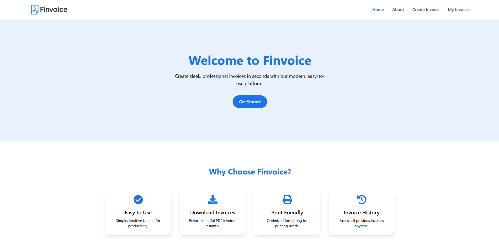
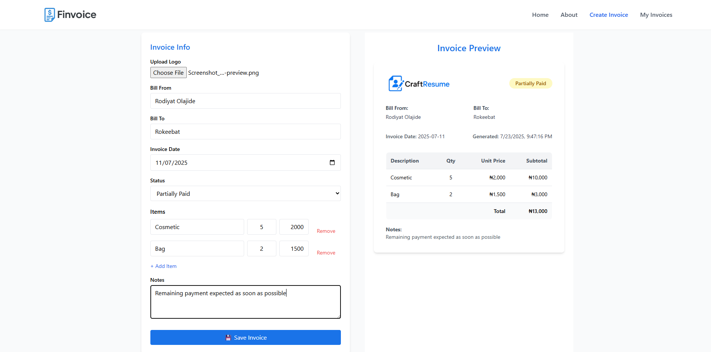
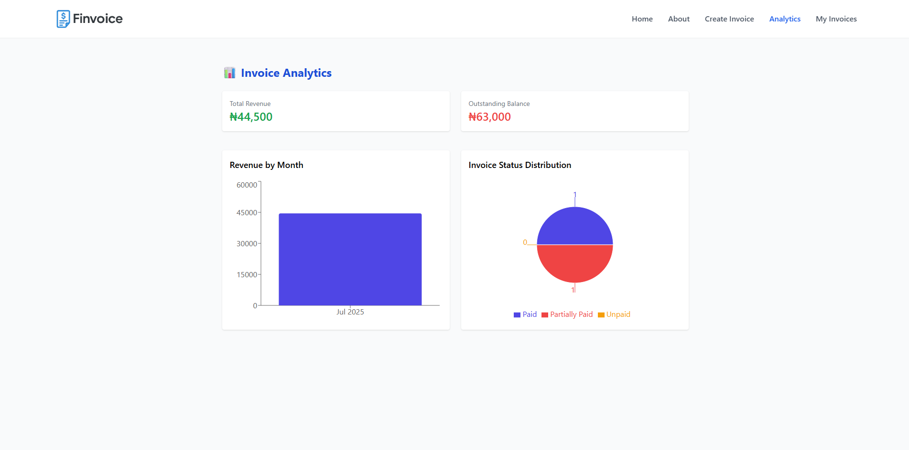
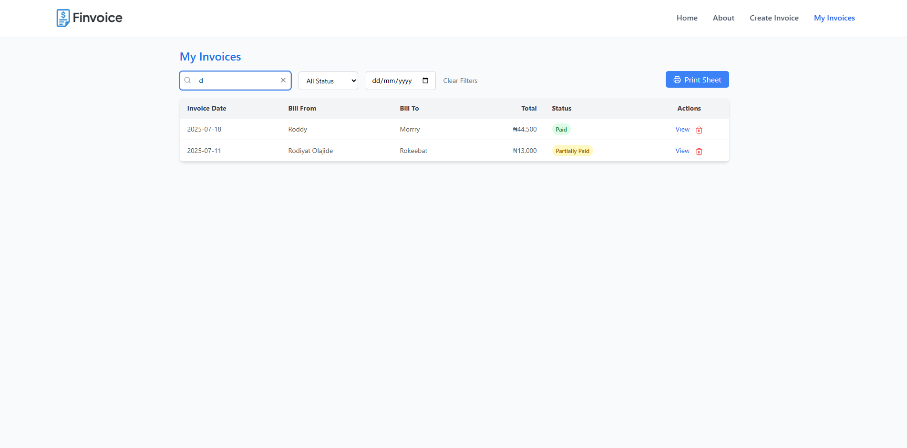
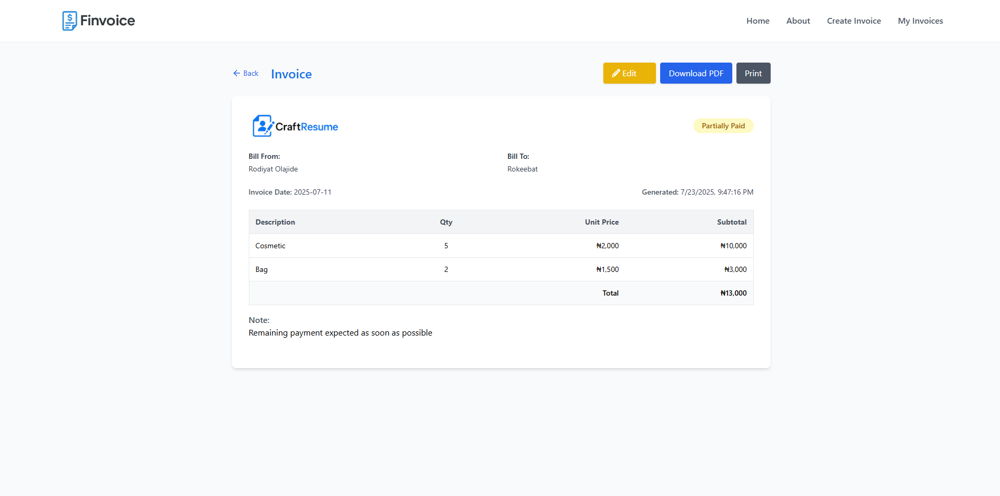
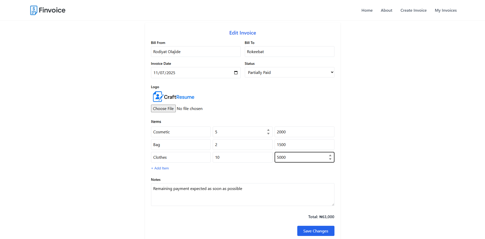

# 💼 Finvoice

Finvoice is a sleek and modern invoice management web application built with React. It enables freelancers, small businesses, and professionals to effortlessly **create**, **edit**, **view**, **print**, **download**, and **manage** invoices - all in one place.

---

## 🚀 Features

* ✅ Create professional invoices with detailed itemized lists
* ✅ Edit existing invoices with live total calculation
* ✅ Upload custom **logos** for branded invoices
* ✅ View invoices in a clean, printable format
* ✅ Download invoices as **PDF**
* ✅ Print invoices directly
* ✅ Filter/search invoices by status, date, sender and recipient

---

## 🛠️ Tech Stack

* **Frontend**: React, Vite and Tailwind CSS
* **Routing**: React Router
* **Animations**: Framer Motion
* **Notifications**: React Toastify
* **PDF Export**: `html2pdf.js` or `jspdf` (optional)
* **Data Storage**: LocalStorage

---

## 📸 Screenshots









---

## 🧑‍💻 Getting Started

### Prerequisites

Make sure you have Node.js and npm installed:

```bash
node -v
npm -v
```

### Installation

1. Clone the repository:

```bash
git clone https://github.com/Dev-Rodiyat/Finvoice.git
cd Finvoice
```

2. Install dependencies:

```bash
npm install
```

3. Start the development server:

```bash
npm run dev
```

The app should now be running at `http://localhost:5173`.

---

## 🗃️ Project Structure

```
src/
├── components/
│   ├── Header.jsx
│   ├── MobileMenu.jsx
│   ├── Footer.jsx
│   ├── ScrollToTop.jsx
│   ├── Layout.jsx
│   └── InvoicePreview.jsx
├── pages/
│   ├── Invoice.jsx
│   ├── Home.jsx
│   ├── About.jsx
│   ├── NotFound.jsx
│   ├── EditInvoice.jsx
│   ├── MyInvoices.jsx
│   └── ViewInvoice.jsx
|
├── App.jsx
└── main.jsx
```

---

## ✅ To Do / Improvements

* 🔒 Add backend integration (Node.js + MongoDB or Firebase)
* 👤 User authentication and saved invoices per account
* 📬 Email invoices to clients
* 🌐 International currency and language support

---

## 📄 License

This project is open-source and available under the [MIT License](LICENSE).

---

## 🙌 Acknowledgements

* Inspired by modern invoicing needs for freelancers and entrepreneurs
* UI/UX based on common best practices
* Thanks to the open-source community

---

Let me know if you'd like me to generate a version with markdown formatting already applied or to include badges (like Netlify deploy, license, etc.).
